# uprpc

# 集群与分布式

## 单机服务器

1. 受限于硬件资源，聊天服务器所能承受的用户的并发量；
2. 任意模块的修改，都会导致整个项目代码重新编译、部署；
3. 系统中，有些模块是属于CPU密集型的，有些模块是属于I/O密集型的，造成各模块对于硬件资源的需求是不一样的；

## 集群服务器

优点：用户的并发量提升了

缺点：

- 项目代码还是需要整体重新编译，而且需要多次进行部署。
- 有很多模块根本不需要高并发。

## 分布式

分布式系统在集群的基础上，进一步将系统拆分成多个独立的子系统，每个子系统都可以独立部署、独立扩展。这样，如果某个子系统需要升级或者扩容，只需要对该子系统进行操作，而不会影响到整个系统的其他模块。此外，分布式系统可以将不同模块放到不同的服务器上，使得不同模块可以使用不同的硬件配置，更好地发挥硬件的性能。但是，分布式系统的开发和维护难度也更大，并且需要考虑各个子系统之间的通信和协作问题。

分布式系统的开发和维护难度更大，并且需要考虑各个子系统之间的通信和协作问题。此外，分布式系统的性能优势只有在系统设计得当，各个子系统之间的通信效率高时才能真正发挥出来。分布式系统需要采用分布式事务来保证数据的一致性，这也是一个比较复杂的问题。最后，分布式系统对于运维的要求更高，需要更多的运维人员来保证系统的稳定性和可靠性。

## 集群与分布式的区别

单机服务器有硬件资源限制，聊天服务器所能承受的用户的并发量有限。任何模块的修改都会导致整个项目代码重新编译、部署。系统中，有些模块是属于CPU密集型的，有些模块是属于I/O密集型的，造成各模块对于硬件资源的需求是不一样的。集群服务器虽然提高了用户的并发量，但是项目代码依然需要整体重新编译，而且需要多次进行部署。此外，有很多模块根本不需要高并发。分布式系统在集群的基础上，进一步将系统拆分成多个独立的子系统，每个子系统都可以独立部署、独立扩展。这样，如果某个子系统需要升级或者扩容，只需要对该子系统进行操作，而不会影响到整个系统的其他模块。此外，分布式系统可以将不同模块放到不同的服务器上，使得不同模块可以使用不同的硬件配置，更好地发挥硬件的性能。但是，分布式系统的开发和维护难度也更大，并且需要考虑各个子系统之间的通信和协作问题。

# RPC通信原理

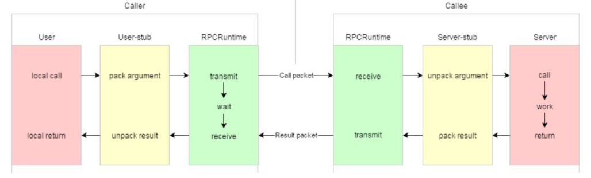

黄色部分：设计rpc方法参数的打包和解析，也就是数据的序列化和反序列化，使用Protobuf。
绿色部分：网络部分，包括寻找rpc服务主机，发起rpc调用请求和响应rpc调用结果，使用muduo网络库和zookeeper服务配置中心（专门做服务发现）。

## protobuf对比json

1. protobuf是二进制存储的，xml和json都是文本存储的。
2. protobuf不需要存储额外的信息，json是存储kv数据。例如：name：“zhang san”，pwd：“123”；而protobuf不存储红色部分。

## RPC框架流程图

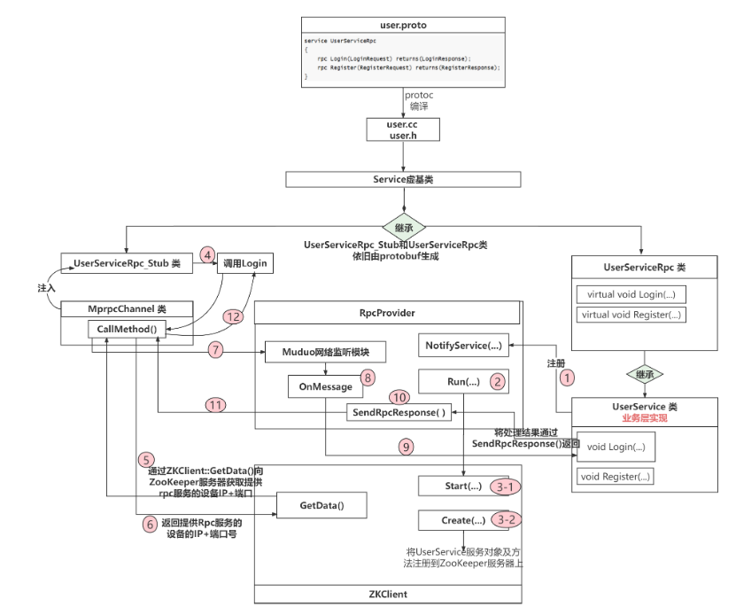

# zookeeper

## 概述

### zookeeper的工作机制

zookeeper从设计模式的角度来理解：是一个基于观察者模式设计的分布式服务管理框架，它负责存储和管理大家关心的数据，然后接受观察者的注册，一旦这些数据的状态发生变化，zookeeper就将负责通知已经在zookeeper上注册的那些观察者做出响应的反应。

### zookeeper的特性

- zookeeper：一个领导者（Leader），多个跟随者（Follower）组成的集群。
- 集群中只要有半数以上节点存活，zookeeper集群就能正常服务，所以zookeeper适合安装奇数台服务器。
- 一致性: 数据一致性, 数据按照顺序分批入库
- 原子性: 事务要么成功要么失败
- 单一视图: 客户端连接集群中的任意zk节点, 数据都是一致的
- 可靠性:每次对zk的操作状态都会保存在服务端
- 实时性: 客户端可以读取到zk服务端的最新数据

### 数据结构

zookeeper的数据模型的结构与Unix文件系统很相似，整体上可以看做是一棵树，每个节点称作一个ZNode。每个ZNode默认能存储1MB的数据，每个ZNode都可以通过其路径唯一标识。

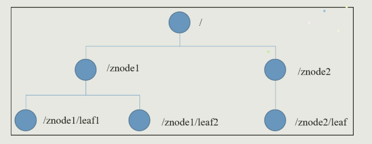

### 节点类型

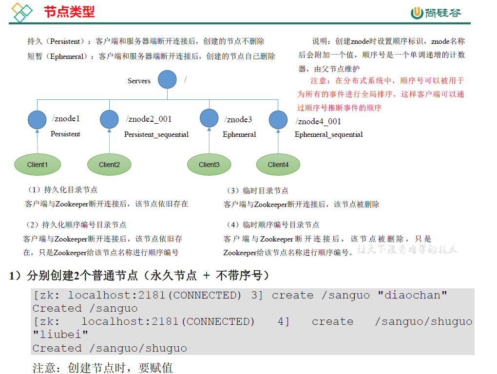

### ZNode节点存储的是什么？

数据结构代码如下

```java
public class DataNode implements Record {
    byte data[];                    
    Long acl;                       
    public StatPersisted stat;       
    private Set<String> children = null; 
}
```

Znode包含了**「存储数据、访问权限、子节点引用、节点状态信息」**，如图：

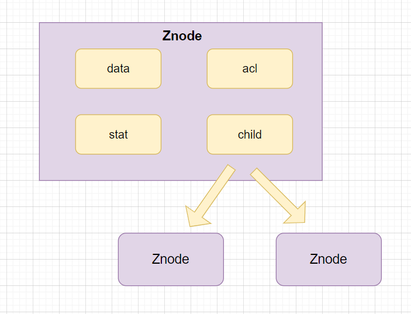

- **「data:」** znode存储的业务数据信息
- **「ACL:」** 记录客户端对znode节点的访问权限，如IP等。
- **「child:」** 当前节点的子节点引用
- **「stat:」** 包含Znode节点的状态信息，比如**「事务id、版本号、时间戳」**等等。

### 应用场景

提供的服务包括：统一命名服务、统一配置服务、统一集群管理、服务器节点动态上下线、软负载均衡等。

1. 命名服务

   命名服务是指通过**「指定的名字」**来获取资源或者服务地址。Zookeeper可以创建一个**「全局唯一的路径」**，这个路径就可以作为一个名字。被命名的实体可以是**「集群中的机器，服务的地址，或者是远程的对象」**等。一些分布式服务框架（RPC、RMI）中的服务地址列表，通过使用命名服务，客户端应用能够根据特定的名字来获取资源的实体、服务地址和提供者信息等。

   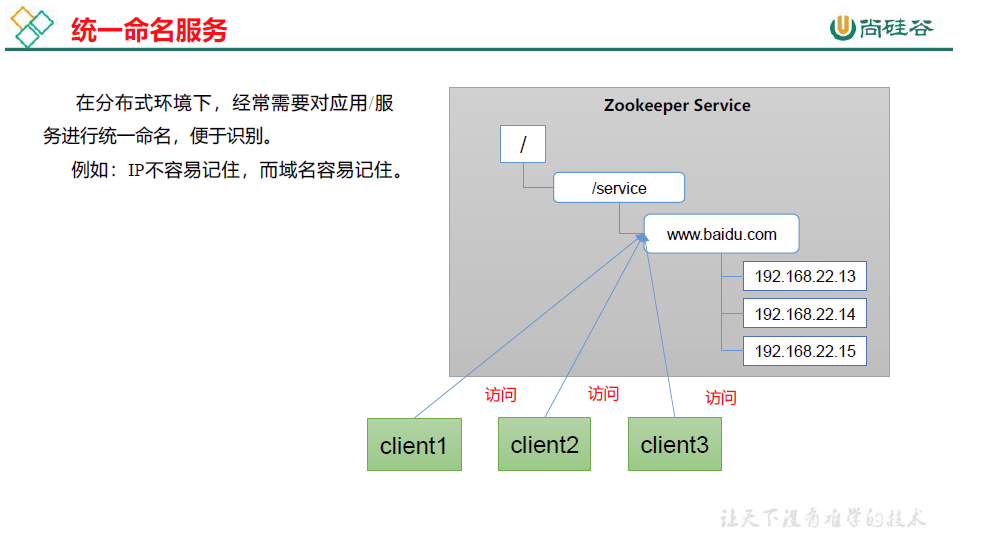

2. 配置管理

   实际项目开发中，我们经常使用.properties或者xml需要配置很多信息，如数据库连接信息、fps地址端口等等。因为你的程序一般是分布式部署在不同的机器上（如果你是单机应用当我没说），如果把程序的这些配置信息**「保存在zk的znode节点」**下，当你要修改配置，即znode会发生变化时，可以通过改变zk中某个目录节点的内容，利用**「watcher通知给各个客户端」**，从而更改配置。

   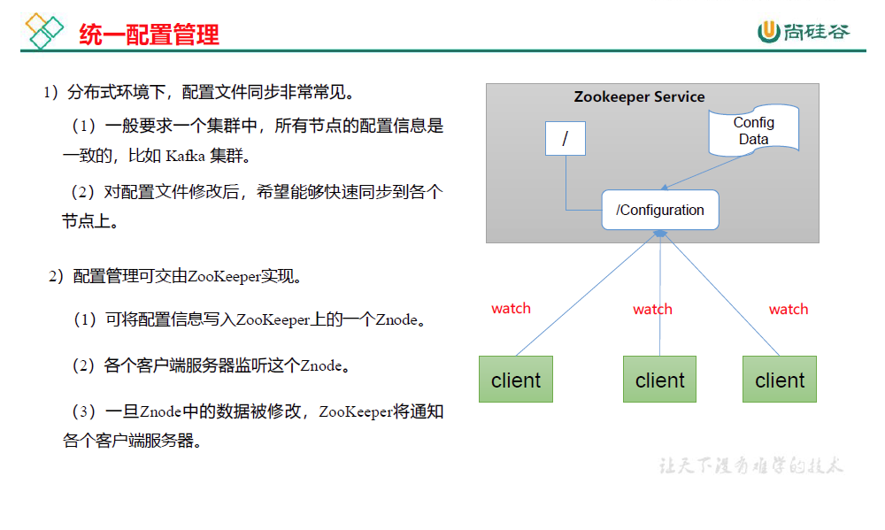

3. 集群管理

   集群管理包括集群监控和集群控制，其实就是监控集群机器状态，剔除机器和加入机器。zookeeper可以方便集群机器的管理，它可以实时监控znode节点的变化，一旦发现有机器挂了，该机器就会与zk断开连接，对用的临时目录节点会被删除，其他所有机器都收到通知。新机器加入也是类似酱紫，所有机器收到通知：有新兄弟目录加入啦。

   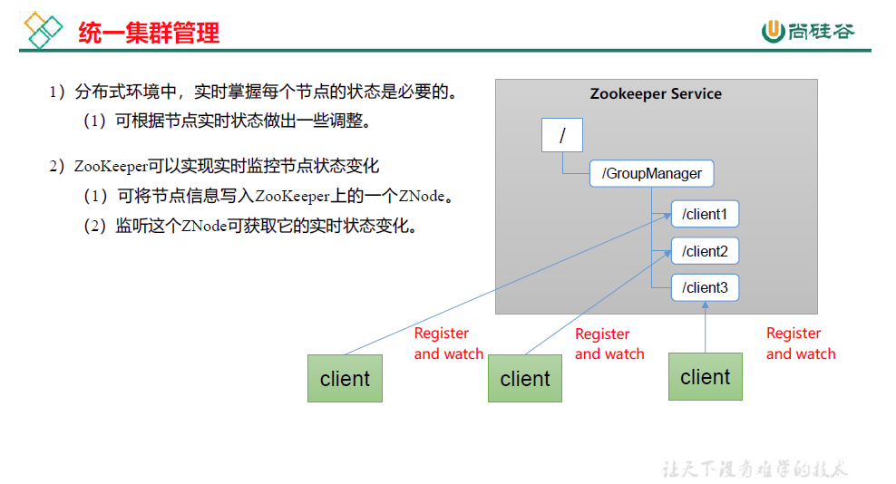

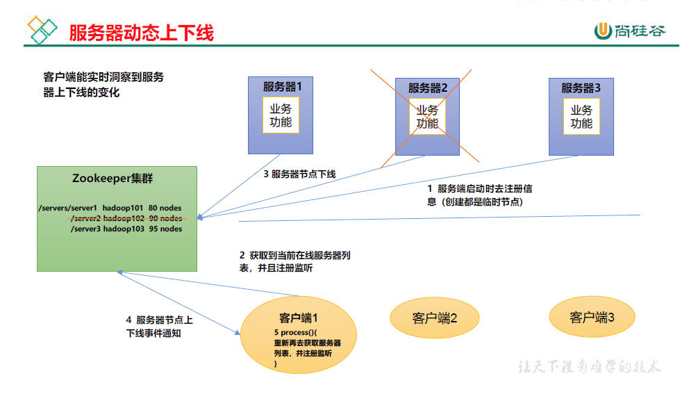

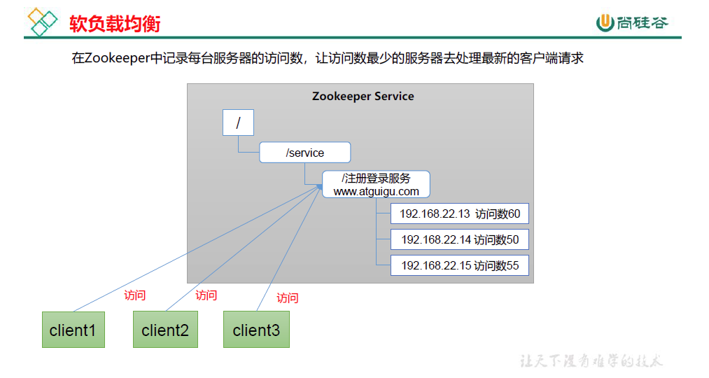

## zookeeper选举机制

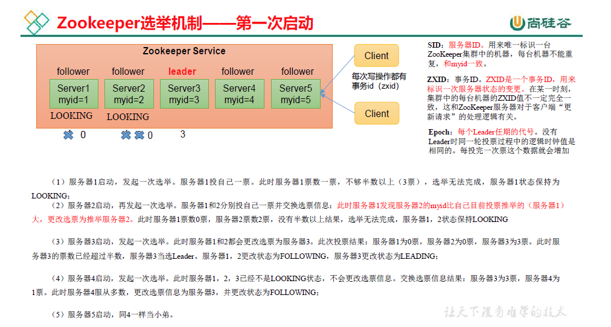

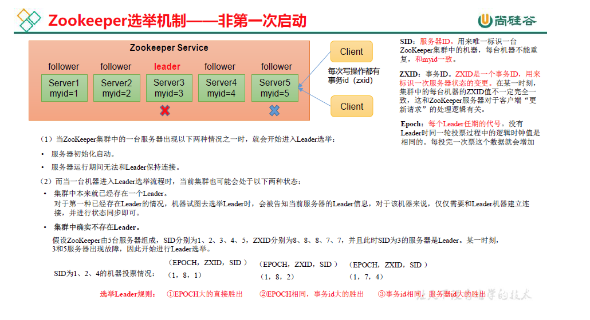

## zookeeper监听机制

Zookeeper 允许客户端向服务端的某个Znode注册一个Watcher监听，当服务端的一些指定事件触发了这个Watcher，服务端会向指定客户端发送一个事件通知来实现分布式的通知功能，然后客户端根据 Watcher通知状态和事件类型做出业务上的改变。（可以把Watcher理解成客户端注册在某个Znode上的触发器，当这个Znode节点发生变化时（增删改查），就会触发Znode对应的注册事件，注册的客户端就会收到异步通知，然后做出业务的改变。）

### ****Watcher监听机制的工作原理****

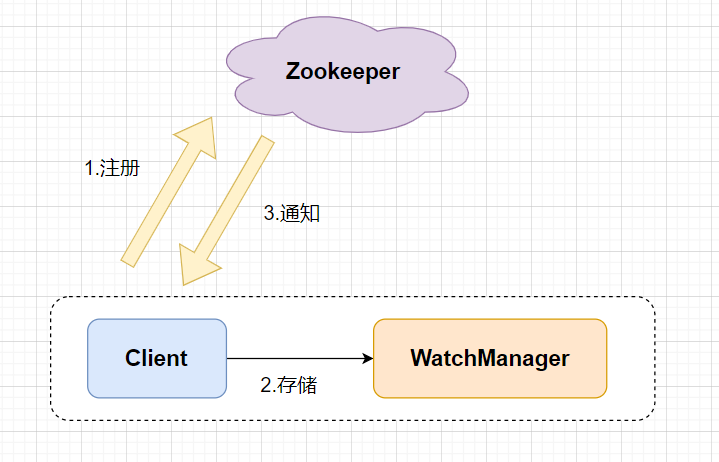

- ZooKeeper的Watcher机制主要包括客户端线程、客户端 WatcherManager、Zookeeper服务器三部分。
- 客户端向ZooKeeper服务器注册Watcher的同时，会将Watcher对象存储在客户端的WatchManager中。
- 当zookeeper服务器触发watcher事件后，会向客户端发送通知， 客户端线程从 WatcherManager 中取出对应的 Watcher 对象来执行回调逻辑。

## zookeeper主从节点的数据一致性（ZAB协议**Zookeeper Atomic Broadcast**）

三种节点状态：

- **Looking** ：选举状态。
- **Following** ：Follower节点（从节点）所处的状态。
- **Leading** ：Leader节点（主节点）所处状态。

最大ZXID：

最大ZXID也就是节点本地的最新事务编号，包含**epoch**和计数两部分。epoch是纪元的意思，相当于Raft算法选主时候的term。

### Zab协议原理

Zab协议要求每个 Leader 都要经历三个阶段：**发现，同步，广播**。

- **发现**：要求zookeeper集群必须选举出一个 Leader 进程，同时 Leader 会维护一个 Follower 可用客户端列表。将来客户端可以和这些 Follower节点进行通信。
- **同步**：Leader 要负责将本身的数据与 Follower 完成同步，做到多副本存储。这样也是提现了CAP中的高可用和分区容错。Follower将队列中未处理完的请求消费完成后，写入本地事务日志中。
- **广播**：Leader 可以接受客户端新的事务Proposal请求，将新的Proposal请求广播给所有的 Follower。